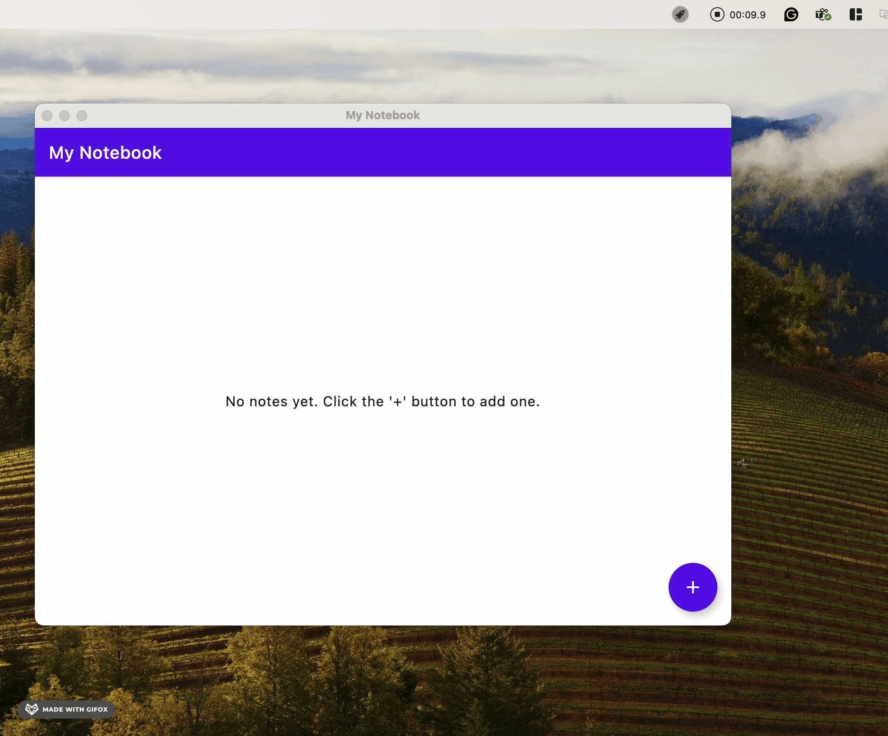

# KPRC and KMP Notebook Demo

A Kotlin Multiplatform demonstration project showcasing **Kotlin RPC (KRPC)** communication between a **Ktor backend** and a **Compose Desktop frontend**, with shared business logic.

##  Project Structure

```
kprc-and-kmp-notebook-demo/
├── shared/                    #  Shared Kotlin Multiplatform module
│   ├── src/                   # Common data models, RPC definitions
│   └── build.gradle.kts       # Kotlin RPC + Serialization
├── app-backend/              #  Ktor Server Backend  
│   ├── src/                   # Server implementation
│   ├── logs/                  # Runtime logs
│   ├── Makefile              # Build & run commands
│   └── build.gradle.kts       # Ktor + RPC Server
├── app-notebook/             #  Compose Desktop Frontend
│   ├── src/                   # UI implementation  
│   ├── Makefile              # Build & run commands
│   └── build.gradle.kts       # Compose Desktop + RPC Client
├── buildSrc/                 #  Build convention plugins
├── gradle/                   #  Version catalog & wrapper
└── settings.gradle.kts       # Multi-module configuration
```

##  How to Run

### Prerequisites
- **Java 17+** 
- **Gradle** (via wrapper)

### Step 1: Start the Backend Server
```bash
cd app-backend
make run
```
*This starts the Ktor server with RPC endpoints, typically on `http://localhost:8080`*

### Step 2: Start the Desktop UI
```bash
cd app-notebook  
make run
```
*This launches the Compose Desktop application that connects to the backend via RPC*

### Alternative: Using Gradle directly
```bash
# Backend
./gradlew :app-backend:run

# Frontend (in separate terminal)
./gradlew :app-notebook:run
```

##  Development Commands

### Backend (`app-backend/`)
```bash
make build    # Build backend
make test     # Run tests  
make clean    # Clean artifacts
make help     # Show all commands
```

### Frontend (`app-notebook/`)
```bash
make build         # Build desktop app
make test          # Run tests
make test-verbose  # Run tests with details
make clean         # Clean artifacts  
make help          # Show all commands
```

## 🛠️ Technology Stack

| Component | Technology | Purpose |
|-----------|------------|---------|
| **Backend** | Ktor Server | HTTP server & routing |
| **Frontend** | Compose Desktop | Native desktop UI |
| **RPC** | Kotlin RPC (KRPC) | Type-safe client-server communication |
| **Navigation** | Voyager | Frontend screen navigation |
| **Build** | Gradle + KMP | Multi-module build system |

## 🧪 Testing

```bash
# Test everything
./gradlew check

# Test specific modules
./gradlew :shared:test
./gradlew :app-backend:test  
./gradlew :app-notebook:test
```

##  Demo

See the application in action:



